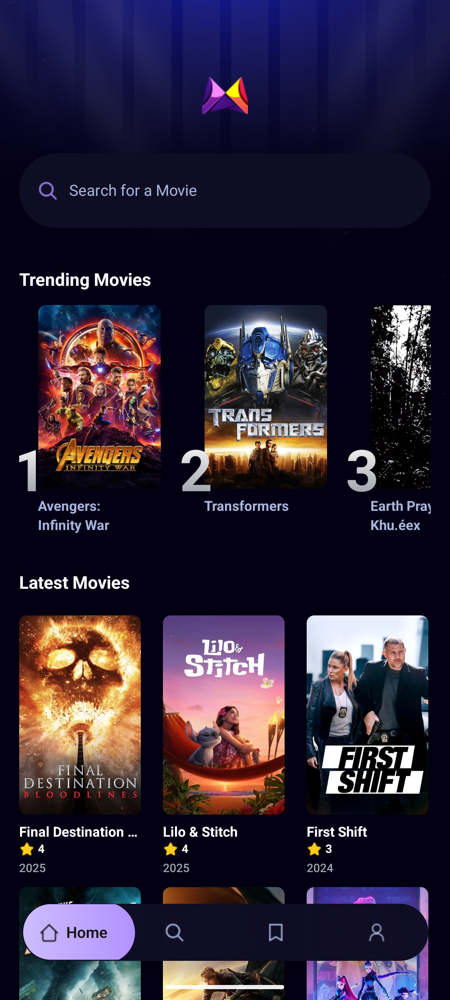
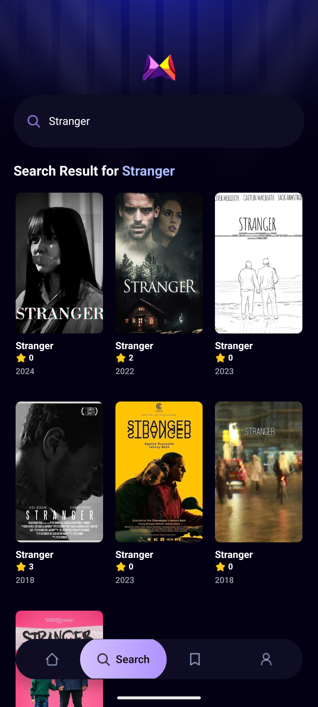
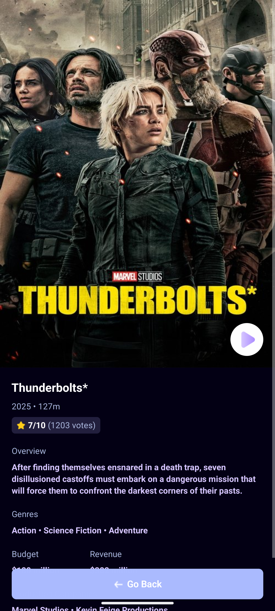

# Mobile Movie App

A React Native mobile application built with Expo that allows users to browse, search, and save their favorite movies. The app provides an intuitive interface for discovering trending movies and managing a personal watchlist.

## Screenshots

  <table>
    <tr>
      <td align="center">
        
         
        <b>Home Screen</b>
      </td>
      <td align="center">
        
         
        <b>Search Screen</b>
      </td>
    </tr>
    <tr>
      <td align="center" colspan="2">
        
         
        <b>Movie Details Page</b>
      </td>
    </tr>
  </table>

## Technologies Used

### Core Technologies
- **React Native** - Cross-platform mobile development framework
- **Expo** - Development platform and toolchain for React Native
- **TypeScript** - Type-safe JavaScript for better development experience
- **Expo Router** - File-based routing system for navigation

### Styling & UI
- **NativeWind** - Tailwind CSS for React Native styling
- **Tailwind CSS** - Utility-first CSS framework for rapid UI development

### State Management & Data
- **Appwrite** - Backend-as-a-Service for user authentication and data storage
- **Custom API Service** - RESTful API integration for movie data
- **Custom Hooks** - Reusable data fetching logic with useFetch

### Development Tools
- **ESLint** - Code linting and quality assurance
- **Babel** - JavaScript compiler for modern syntax support
- **Metro** - JavaScript bundler for React Native

## Brief Design Rationale

### Architecture Decisions
- **File-based Routing**: Utilized Expo Router for intuitive navigation structure with tab-based layout
- **Component-driven Design**: Modular components (MovieCard, TrendingCard, SearchBar) for reusability and maintainability
- **Service Layer**: Separated API logic into dedicated services for clean architecture
- **Type Safety**: Comprehensive TypeScript interfaces for better code reliability

### UI/UX Design Philosophy
- **Mobile-first Approach**: Designed specifically for mobile interaction patterns
- **Consistent Visual Language**: Unified styling system using NativeWind/Tailwind
- **Performance Optimization**: Efficient image loading and smooth scrolling experiences
- **Accessibility**: Semantic component structure for better screen reader support

### Data Management
- **Custom Hook Pattern**: useFetch hook for consistent data fetching across components
- **Local Storage**: Appwrite integration for persistent user data and saved movies
- **Error Handling**: Robust error states and loading indicators

## How to Run the App Locally

### Prerequisites
- Node.js (v16 or higher)
- npm or yarn package manager
- Expo CLI (`npm install -g @expo/cli`)
- iOS Simulator (for iOS development) or Android Studio (for Android development)
- Expo Go app on your physical device (optional)

### Installation Steps

1. **Clone the repository**

   git clone <repository-url>
   cd mobile_movie_app

2. **Install dependencies**

   npm install

3. **Set up environment variables**
   - Create necessary configuration files for API keys
   - Configure Appwrite project settings

4. **Start the development server**

   npx expo start

5. **Run on device/simulator**
   - **iOS Simulator**: Press `i` in the terminal
   - **Android Emulator**: Press `a` in the terminal
   - **Physical Device**: Scan QR code with Expo Go app

### Additional Commands
- **Type checking**: `npx tsc --noEmit`
- **Linting**: `npx eslint .`
- **Build for production**: `npx expo build`

## Usability Heuristics Focused On

### 1. Visibility of System Status
- **Loading States**: Clear loading indicators during data fetching
- **Search Feedback**: Real-time search results and empty state handling
- **Navigation Indicators**: Active tab highlighting in bottom navigation

### 2. Match Between System and Real World
- **Familiar Icons**: Intuitive icons for search, profile, and saved items
- **Movie Metaphors**: Card-based layout mimicking physical movie posters
- **Natural Language**: Clear, conversational error messages and labels

### 3. User Control and Freedom
- **Easy Navigation**: Bottom tab navigation for quick access to main sections
- **Search Control**: Ability to clear search and start over
- **Save/Unsave**: Easy toggle for adding/removing movies from saved list

### 4. Consistency and Standards
- **Design System**: Consistent spacing, typography, and color scheme throughout
- **Interaction Patterns**: Uniform touch targets and gesture responses
- **Component Reusability**: Standardized MovieCard and TrendingCard components

### 5. Error Prevention
- **Input Validation**: Search input handling to prevent empty or invalid queries
- **Network Error Handling**: Graceful degradation when API calls fail
- **Type Safety**: TypeScript implementation to prevent runtime errors

### 6. Recognition Rather Than Recall
- **Visual Cues**: Movie posters and titles for easy recognition
- **Persistent Navigation**: Always-visible bottom tabs for orientation
- **Search History**: Contextual search suggestions and recent searches

### 7. Flexibility and Efficiency of Use
- **Quick Actions**: Swipe gestures and touch interactions for power users
- **Multiple Access Paths**: Various ways to discover movies (trending, search, saved)
- **Responsive Design**: Optimized for different screen sizes and orientations

### 8. Aesthetic and Minimalist Design
- **Clean Interface**: Focused content presentation without clutter
- **Purposeful Elements**: Every UI element serves a specific function
- **Visual Hierarchy**: Clear information architecture with proper spacing

### 9. Help Users Recognize, Diagnose, and Recover from Errors
- **Clear Error Messages**: Descriptive error states with actionable solutions
- **Network Status**: Offline/online state awareness
- **Retry Mechanisms**: Easy ways to retry failed operations

### 10. Help and Documentation
- **Intuitive Interface**: Self-explanatory UI reducing need for external help
- **Contextual Guidance**: In-app hints and empty state instructions
- **Consistent Patterns**: Familiar interaction patterns reducing learning curve

## Features

- **Movie Discovery**: Browse trending movies with horizontal scrolling
- **Search Functionality**: Find movies by title with real-time results
- **Personal Watchlist**: Save and manage favorite movies
- **Detailed Movie Views**: Comprehensive movie information and metadata
- **Responsive Design**: Optimized for various mobile screen sizes
- **Offline Support**: Cached data for improved performance
